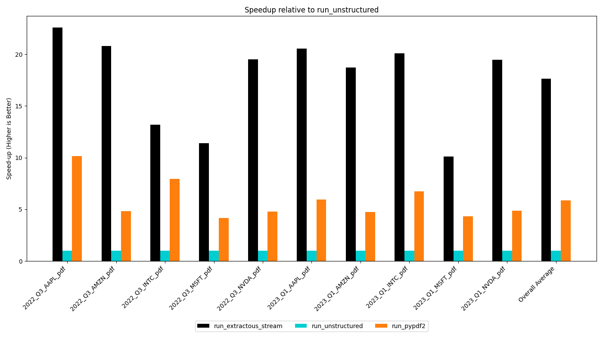
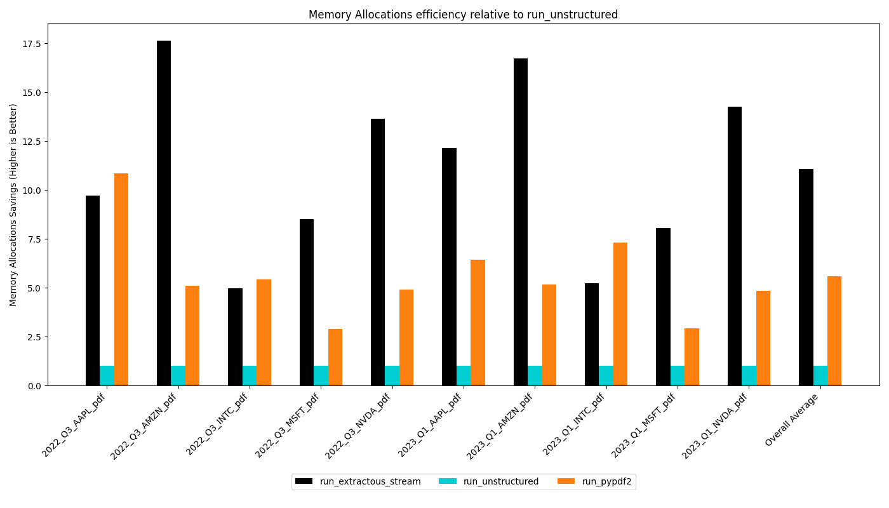

## README

This directory contains various reference results, images and docs that are used in extractous documentation.

### Results

* [`extractous`](https://github.com/yobix-ai/extractous) speedup relative to [`unstructured-io`](https://github.com/Unstructured-IO/unstructured)

* [`extractous`](https://github.com/yobix-ai/extractous) memory efficiency relative to [`unstructured-io`](https://github.com/Unstructured-IO/unstructured)

### Demo

* Benchmarking [`extractous`](https://github.com/yobix-ai/extractous) and
[`unstructured-io`](https://github.com/Unstructured-IO/unstructured):

